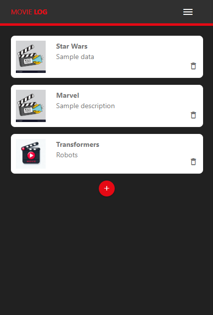
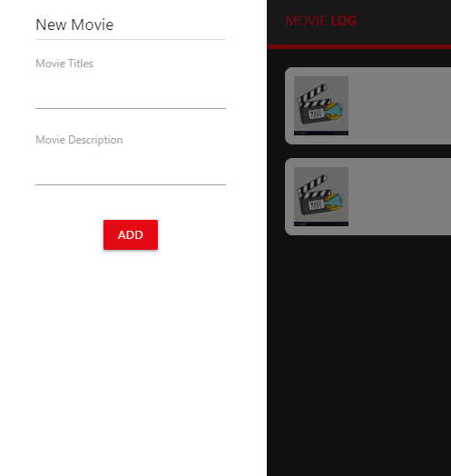
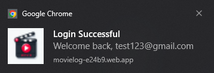
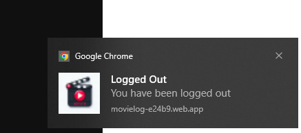
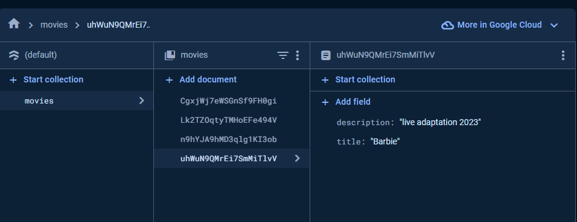

# INF654-Final-Project - Movie Log Watchlist

This project is to develop a Progressive Web Application that incorporates key PWA features that we learned. Including a manifest file, service worker, offline capabilities, data storage, and integration with Firebase for database operations and user authentication. I continued the prototype developed in Assignment 3 that was implemented using CSS, HTML, and Materialize CSS framework. The web application is designed to serve as a personal movie collection manager, where users can catalog and manager their movie library/collection. With the potential to expand to shows, various streaming platforms, and multiple filtering/options to display and organize entries.

## Features

- Responsive design for optimal user experience across devices.
- Seamless navigation with an interactive menu.
- Complete CRUD operations for managing movie entries.
- Firebase database integration for storing and handling data.
- User authentication allowing users to login and register for personalized access.
- User-friendly interface for adding new entries to the watchlist.
- IndexedDB for local data storage enchancing offline capabilities.
- Local push notifications to engage and inform users
- (more soon)

## Built With

- HTML, CSS, and JavaScript
- [Materialize CSS](https://materializecss.com/) - framework for responsive design and styling
- [Firebase](https://firebase.google.com/) - for backend services including database and authentication

## Setup and View/Usage

1. Clone the repository using: `git clone https://github.com/HernandezA1007/INF654-Assignment4.git` and open the `index.html`.
2. Navigate through the application using the navigation bar and side menus and interact with application by adding, viewing, and deleting movie entries. Can sign up and log in/out to view personal collection.
3. If local host does not look correct (pictures in gallery below), `npm i` and do `npx firebase deploy` though ensure you're logged into Firebase before deploying.

- Alternatively you can go to `https://movielog-e24b9.web.app/` for my firebase hosted site.

## Development Roadmap

- [x] Manifest.json
- [x] Service Worker File
- [x] Handling Service Worker
- [x] Local Data Caching
- [x] Offline Functionality
- [x] Firebase Integration and CRUD Operations
- [x] User Authentication
- [x] Data Storage in IndexedDB
- [x] Push Notifications - (local only)
- (more soon)

## Gallery

Updated home page logged out

Mobile view and side-form

    
    

Login and logout notifications

    
    

Firebase database receiving new movie entries

## Future Enchancements

1. Add location information: Streaming platform information e.g., Netflix or Hulu with their logo
2. Genre area: With main or selection and allow checkboxes
3. Filtering: Allow filtering based on multiple options
4. Media Type: Movie or Show and (Stage, Music, Video Game?)
5. More Themes: Selection of schemes and layouts
6. Episode Count for Shows: Provides number episodes to distinguish between show and movie + seasons
7. Fix User-Interface for Server/Local Hosting: Broken due to pathing b/c of Firebase hosting /public
8. API for Movie Thumbnails: For visual appeal and distinguish between cards/entries
9. API for more Movie information: descriptions otherwise add their own
10. Contact page is incomplete/not supported
11. API for Movie/Show data: Search for movies and shows to provide a better database
